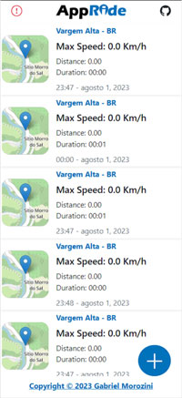
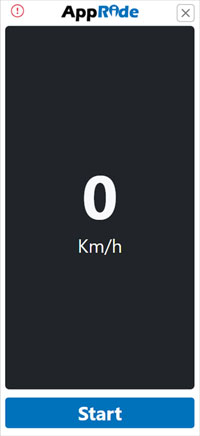
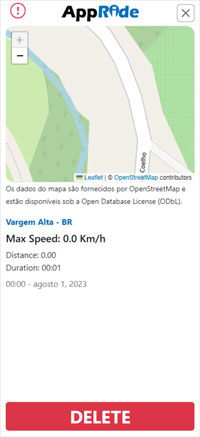

  

## 📚 Sobre o projeto 

O **[AppRide](https://appride.gabrielmorozini.com.br/)** é um projeto desenvolvido durante o curso [Programador BR](https://programadorbr.com/), que visa oferecer uma experiência personalizada para usuários registrarem e analisarem suas atividades físicas que envolvam deslocamento, como corridas, caminhadas, ciclismo, skate, entre outras. Este aplicativo foi projetado para acompanhar e fornecer informações detalhadas sobre a velocidade máxima atingida, distância percorrida, duração da atividade, localização geográfica e a data em que ocorreu o registro. 

Além disso, o **[AppRide](https://appride.gabrielmorozini.com.br/)** apresenta um recurso de visualização de mapa, que permite aos usuários visualizar os percursos realizados durante suas atividades, agregando uma dimensão visual única à sua jornada esportiva.

## 💡 Principais recursos

**Calculadora de velocidade máxima:** Permite que você calcule sua velocidade máxima durante a atividade, ajudando você a monitorar seu desempenho e estabelecer metas de melhoria.

**Cálculo de distância e duração:** Com as informações coletadas através da [API de geolocalização do objeto Navigator](https://developer.mozilla.org/en-US/docs/Web/API/Navigator/geolocation), o **[AppRide](https://appride.gabrielmorozini.com.br/)** é capaz de fornecer a distância percorrida e o tempo total de duração da sua atividade física, fornecendo uma visão abrangente do seu desempenho.

**Registro de local e data:** O aplicativo registra **localmente em seu dispositivo [(localStorage)](https://www.w3schools.com/jsref/prop_win_localstorage.asp)** a localização geográfica e a data de cada atividade, permitindo que você mantenha um histórico detalhado de suas conquistas.

**Mapa interativo e visualização do percurso:** Graças à integração das APIs oferecidas pelo [Leaflet](https://leafletjs.com/) e  [OpenStreetMap](https://www.openstreetmap.org/#map=4/-21.21/-15.47), o **[AppRide](https://appride.gabrielmorozini.com.br/)** exibe um mapa interativo, mostrando exatamente o percurso percorrido durante a atividade, dessa forma relembrando os lugares por onde passou.

## 🚀 App em execução 

| Tela de inicial sem dados | Tela de inicial com dados  |
|:-------------:|:------------:|
|  |  |

---

| Tela de captura de dados | Tela de detalhes do registro  |
|:-------------:|:------------:|
|  |  |

### 🌐 Para acessar o AppRide clique no link abaixo 

https://appride.gabrielmorozini.com.br/

## 🖥️ Tecnologias utilizadas

* HTML
* CSS
* JavaScript
* BootStrap

## 📌 Atribuições 

### ✔ - Bootstrap 

Este é um projeto que utiliza o Bootstrap para estilização e componentes front-end, e também usa o Bootstrap Icons para ícones.

- **Bootstrap**
  - Partes do software [Bootstrap](https://getbootstrap.com/) são sujeitas à licença MIT ([Licença](https://github.com/twbs/bootstrap/blob/main/LICENSE)).

 

- **Bootstrap Icons**
  - Partes do software [Bootstrap Icons](https://icons.getbootstrap.com/) são sujeitas à licença MIT ([Licença](https://github.com/twbs/icons/blob/main/LICENSE)).

---

### ✔ - Popper

Desenvolvido com o uso do [Popper.js](https://popper.js.org/), uma biblioteca JavaScript para posicionamento de elementos na página. Licenciado sob a [MIT License](https://github.com/floating-ui/floating-ui/blob/master/LICENSE).

---

### ✔ - Leaflet 

Este projeto utiliza o [Leaflet](https://leafletjs.com/) para mapas interativos.

  - Este projeto utiliza o Leaflet, uma biblioteca de código aberto distribuída sob a [licença BSD de 2 cláusulas](https://github.com/Leaflet/Leaflet/blob/main/LICENSE).

---

### ✔ - OpenStreetMap

Este projeto utiliza dados do [OpenStreetMap](https://www.openstreetmap.org/#map=4/-21.21/-15.47), que estão licenciados sob a Licença de Banco de Dados Aberto da Oper Data Commons (ODbL). 

© Contribuidores do OpenStreetMap (https://www.openstreetmap.org/copyright).

 

## ✒️ Licença

Esse projeto está sob licença MIT. Leia o arquivo <a href="./LICENSE" >LICENSE</a> para mais detalhes.

Copyright (c) 2023 Gabriel Morozini

 

  

  
  
       
  

